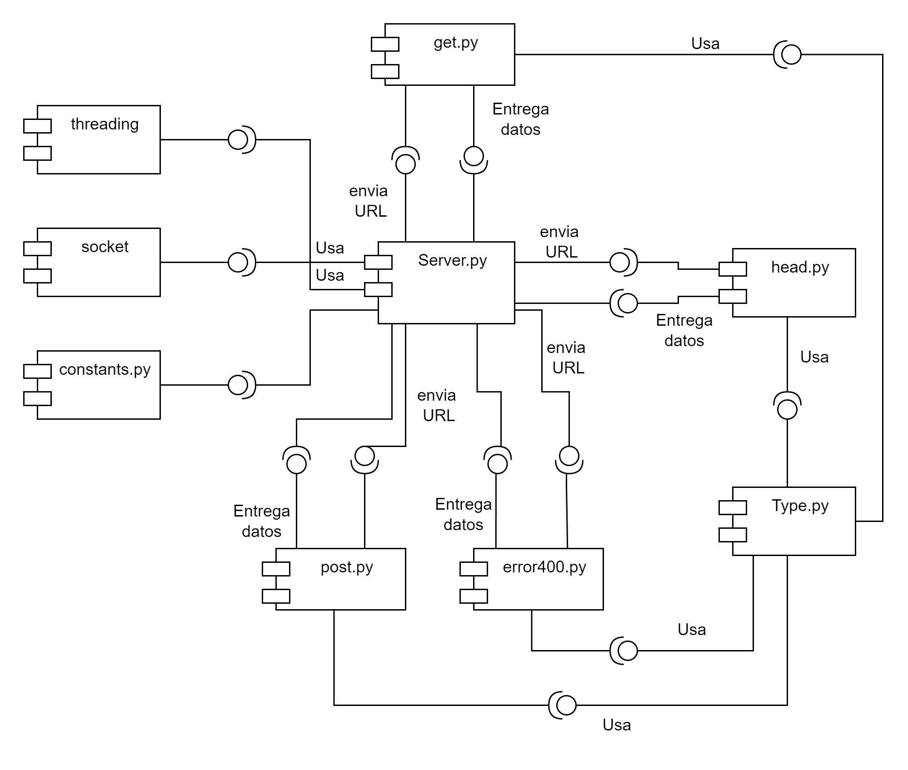

# **Documentacion TWS Telematica**

*******

**Tabla de Contenido**

1. [Introducción](#introduction)
2. [Desarrollo](#development)
3. [Conclusiones](#conclusion) 
4. [Referencias](#references)<br>

*******

<div id='introduction'/> 

### **i. Introduccion**
En nuestro mundo actual, la transferencia de datos y la comunicación entre dispositivos se realiza a través de diferentes protocolos de red. Siendo  así, el protocolo de internet TCP/IP como uno de los más utilizados, el cual es una arquitectura de red que proporciona una forma estándar de comunicación entre diferentes dispositivos conectados a internet. De esta manera, podemos encontrar dentro de la arquitectura la capa de aplicación, la cual es primordial para la comunicación entre aplicaciones y servicios.

Por lo tanto, el siguiente proyecto tiene como objetivo explorar y enfatizar la aplicación de la capa de aplicación de la arquitectura TCP/IP, específicamente en el estudio del protocolo HTTP desde un punto de vista de programación en red. El protocolo HTTP(Hyper Text Transfer Protocol) es el protocolo de comunicación utilizado en la World  Wide Web para la transferencia de datos de un servidor web a un cliente, actuando como un navegador web.

Para lograr este objetivo, se desarrollará e implementará un servidor web llamado Telematics Web Server (TWS), que tendrá como función principal la entrega de recursos web a los clientes que lo soliciten. Estos recursos pueden ser páginas HTML, archivos de estilo, imágenes, entre otros.

Para la implementación de este proyecto, se utilizará la versión del protocolo HTTP/1.1 para el servidor web TWS; el cual es uno de los protocolos más usados en la actualidad para la comunicación entre servidores web y clientes. En resumen, el proyecto TWS es una excelente oportunidad para sumergirse en el mundo de la programación de redes y explorar los diferentes aspectos del protocolo HTTP en un entorno práctico y real.
*******

<div id='development'/> 

### **ii. Desarrollo**
Para el desarrollo del proyecto se tuvo como base el Laboratorio de Sockets Multi Thread realizado por el docente, ademas, se comparo con el Laboratorio de Sockets Secuencial, para comprender el funcionamiento y como se implementaban los hilos para el manejo de multiples peticiones.

Fue un proyecto que fue desarrollado en Python, no gracias a su rapidez ni fluidez sino, debido al facil y amplio manejo que tenemos en el lenguaje, se desplego en AWS y se uso el servidor web de Apache2.

Implementamos las siguientes librerias para el desarrollo del proyecto:

* **socket**
* **threading**
* **os**
* **time**

Adicionalmente a estas librerias, se desarrollo un analizador de extensiones, el cual se encarga de decir que tipo de mimetype posee cada archivo, esta funcion es utilizada a la hora de enviar una respuesta al usuario.

A partir de la libreria socket se establece y se crea la conexión con el servidor, la libreria threading es utilizada para el manejo de multiples hilos, lo que permite realizar multiples conexiones y peticiones al tiempo y cada usuario llamara a la funcion handler_client_connection. Esta funcion esta diseñada para manejar las peticiones del usuario, en este caso y para este proyecto, solo se aceptan las peticiones HEAD, GET, POST y QUIT, esta ultima para cerrar la conexion con el servidor.

handler_client_connection es una funcion que se continuara ejecutando por el usuario hasta que la peticion que este solicite sea un QUIT, en caso contrario, continuara procesando las peticiones y llamando a sus respectivas funciones; tenemos definidas, get, post, head y error400, cada una de las funciones trabaja de manera similar, ya que reciben un path, o url que es dado por la peticion del usuario, teniendo como base que una peticion esta dada como la siguiente:

```sh
GET / HTTP/1.1
```

De la cual, extraemos el '/' que seria el archivo pedido y tomamos datos como lo son: su tamaño, tipo de archivo, fecha en la que fue realizada la peticion con base al estandar GMT, un ETag generado con base a la ultima modificacion del archivo, la ultima modificacion del archivo y dado el caso, el archivo, estos datos son almacenados para luego ser entregados a la funcion handler_client_connection que entregara una respuesta a la peticion del usuario. El sistema tambien permite el uso de headers, aunque realmente solo se implementaron Connection y Keep-Alive, que se pasan como parametros en la peticion como se muestra acontinuacion:

```sh
GET / HTTP/1.1
Keep-Alive: timeout=5
Connection: Keep-Alive
```
En la peticion pueden ir incluidos los headers o no tenerlos, no afecta el funcionamiento del programa, adicional, si se le ingresan headers que no estan establecidos, no genera error como tal, pero no seran tomados encuenta a la hora de entregar una peticion al usuario.



Aqui presentamos una posible respuesta a una solicitud:

```sh
HTTP/1.1 200 OK
Date: Tue, 18 Apr 2023 21:44:43 GMT
Server: Apache/2.4.41 (Ubuntu)
Content-Type: text/html ; UTF-8
Content-Length: 1175
Connection: Keep-Alive
```

Se manejan estados y errores como lo son:

* **200 OK**: Indica que la peticion fue entregada con exito.
* **400 Bad Request**: Indica que la peticion realizada es incorrecta.
* **404 Not Found**: Indica que el archivo requerido no fue encontrado dentro del servidor.
* **405 Method Not Allowed**: Indica que la peticion no se puede realizar en la direccion especificada.

*******

<div id='conclusion'/> 

### **iii. Conclusiones**
En conclusión, el proyecto de desarrollo e implementación del servidor web Telematics Web Server (TWS) se enfocó en explorar la aplicación de la capa de aplicación de la arquitectura TCP/IP, específicamente en el estudio y programación del protocolo HTTP desde una perspectiva de red. La principal función de un servidor web es la entrega de recursos web a los clientes que lo solicitan, y para ello se utilizamos el protocolo HTTP en su versión 1.1.

Para lograr este proyecto, se llevó a cabo una implementación detallada del servidor web, que incluyó el manejo de solicitudes HTTP GET, HEAD y POST, así como la generación de respuestas correspondientes, incluyendo códigos de estado, descripciones, fechas, tipos de contenido y longitudes. Además, se implementaron errores HTTP, incluyendo el código de estado 400 (solicitud incorrecta), 404 (no encontrado) y 405 (método no permitido).

El servidor web TWS también se diseñó para ser escalable y permitir la conexión de múltiples clientes simultáneamente mediante el uso de hilos de ejecución. Se utilizó la biblioteca estándar de Python, incluyendo los módulos socket y threading, así como otras bibliotecas personalizadas que se crearon para manejar solicitudes y generar respuestas.

En resumen, el proyecto fue un éxito en términos de implementar un servidor web funcional que cumple con los requisitos de HTTP/1.1 y que puede soportar múltiples conexiones de clientes de manera simultánea. Además, el proyecto permitió a los estudiantes a profundizar en el conocimiento de la programación de red y en el uso de la biblioteca estándar de Python para crear aplicaciones de red complejas. Este proyecto también puede servir como una base sólida para proyectos futuros que involucren la programación de aplicaciones de red complejas.
*******

<div id='references'/> 

### **iv. Referencias**

* https://github.com/ST0255/st0255-20231/tree/main/LabSocketsMultiThread
* https://datatracker.ietf.org/doc/rfc2616/
* https://www.postman.com/
* https://developer.mozilla.org/es/docs/Web/HTTP/Basics_of_HTTP/MIME_types/Common_types
*******

